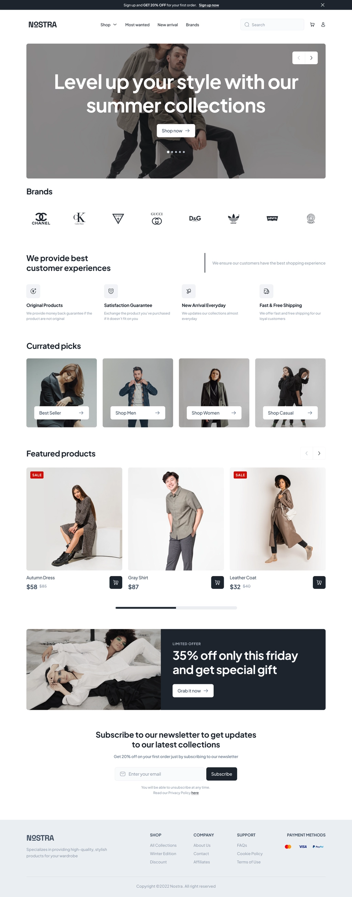
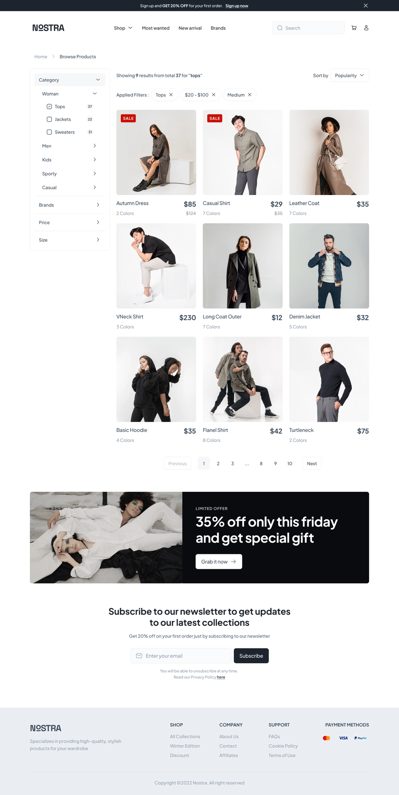
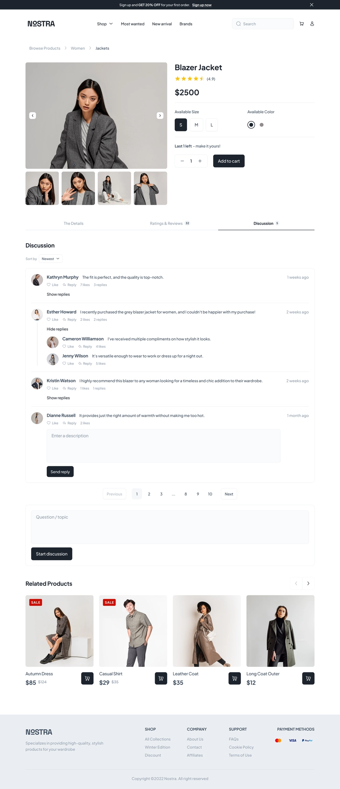
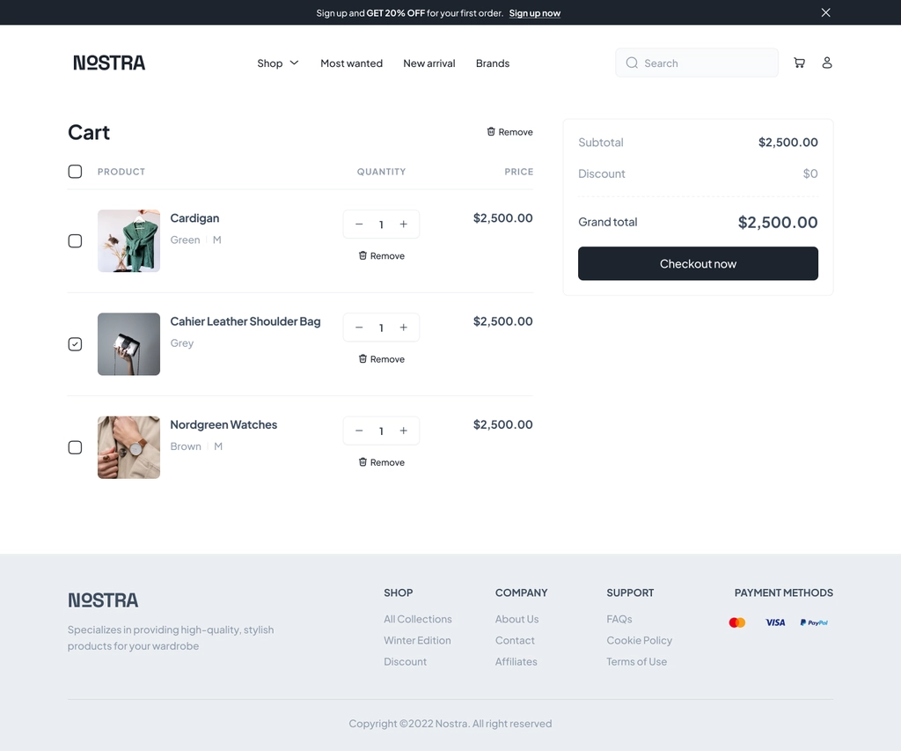

# Nostra Headless Shop

Headless Shop is an e-commerce web application built with Next.js 13, TypeScript, Tailwind CSS, and Shadcn-UI. It leverages a Shopify Storefront as the backend, with Prisma and PostgreSQL for data storage. Data fetching is handled using Apollo Client, and state management is achieved with Redux Toolkit.

## Table of Contents

- [Demo](#demo)
- [Design](#design)
- [Features](#features)
- [Technologies](#technologies)
- [Setup](#setup)
- [Usage](#usage)
- [Contributing](#contributing)
- [License](#license)

## Demo

Check out the live site at [Headless Shop](https://nostra-three.vercel.app/).

## Design

Here are some design previews of the Headless Shop web application:

### Home Page



### Shop Page (All Products)



### Product Detail Page



### Cart Page



## Features

- **Shopfront Integration**: Headless Shop integrates with a Shopify Storefront, providing a seamless e-commerce experience.
- **Data Fetching**: Apollo Client is used for efficient and flexible data fetching from the backend.
- **State Management**: Redux Toolkit is employed for centralized state management, ensuring a smooth user experience.
- **Responsive Design**: The application is designed to be responsive and user-friendly on various devices.
- **Customizable Styles**: Tailwind CSS and Shadcn-UI are used for easily customizable and beautiful UI components.
- **Database Storage**: Prisma and PostgreSQL are used to store and manage application data efficiently.

## Technologies

- Next.js 13
- TypeScript
- Tailwind CSS
- Shadcn-UI
- Apollo Client
- Redux Toolkit
- Shopify Storefront
- Prisma
- PostgreSQL

## Setup

1. Clone the repository:

   ```shell
   git clone https://github.com/madeelchaudhary/headless-shop.git
   ```

2. Navigate to the project directory:

   ```shell
   cd headless-shop
   ```

3. Install the dependencies:

   ```shell
    npm install
   ```

4. Configure your environment variables, including your Shopify Storefront credentials and database connection details.

5. Run the database migrations:

   ```shell
   npx prisma migrate dev --name init
   ```

6. Run the development server:

   ```shell
   npm run dev
   ```

7. Navigate to [http://localhost:3000](http://localhost:3000) in your browser to view the application.

## Usage

1. Browse the products on the home page.
2. Navigate to the shop page to view all available products.
3. Click on a product to see its details on the product detail page.
4. Add items to your cart and proceed to the cart page to review and place your order.
5. Enjoy shopping!

## Contributing

Contributions are welcome! Please feel free to submit a Pull Request.

## License

[MIT](LICENSE)
